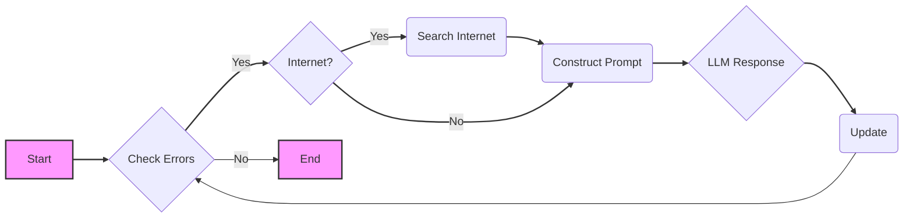

<div align="center">

Automated debugging tool that uses language models and internet search to fix errors in Python code

     

</div>

I implemented an AI debugger that uses a language model to provide suggestions for fixing errors in Python code. The debugger can interact with different language models (LLMs) like OpenAI's GPT-3, Hugging Face's Transformers, and Google's Gemini. The debugger can also fetch data from the internet to provide more context and suggestions for fixing errors. The project is structured to be modular and extensible, allowing for easy integration of new LLMs and internet search capabilities.

<!-- omit in toc -->
## Table of Contents
- [How AI Debugger Works](#how-ai-debugger-works)
- [Codebase Overview](#codebase-overview)
- [Installation and Setup](#installation-and-setup)
- [Usage](#usage)
- [More LLMs](#more-llms)
- [License](#license)
- [Acknowledgements](#acknowledgements)
- [Internet Search](#internet-search)
- [Contributing](#contributing)

## How AI Debugger Works



The above flowchart that shows the process of the AI debugger. The debugger starts by checking for errors in the code. If there are errors, it checks if the internet is enabled. If the internet is enabled, it searches the internet for solutions. If the internet is not enabled, it constructs a prompt for the LLM. The LLM provides a response, which is used to update the code. The process continues until there are no more errors in the code.

## Codebase Overview

This project is structured to be modular and extensible. Here's a breakdown of the main directories and their responsibilities:

*   **`src/`**: This directory contains all the source code for the project.
    *   **`src/core/`**: Contains the core logic of the debugger, including:
        *   `debugger.py`: The `CodeDebugger` class, which handles the debugging loop, error analysis, and interaction with the LLM.
        *   `llm.py`: An abstract base class `LLMInterface` to define the structure for various LLM integrations.
        *   `llm_factory.py`: The `LLMFactory` class, responsible for creating instances of different LLM implementations based on configuration.
        *   `utils.py`: Contains utility functions like `get_diff` for comparing code changes.
    *   **`src/internet/`**: Contains the code responsible for fetching data from the internet.
        *   `search.py`:  The `coolas` function which uses `scrapling` library to get urls from the google.
    *   **`src/prompts/`**: Contains the different prompt for LLM.
        *   `system_prompts.py`: Contains the system prompt that will be used in code debugging.
         *   `query_prompt.py`: Contains the system prompt that will be used in google search query generation.
    *   **`src/llms/`**: Contains implementations for different LLMs.
        *   `openai_llm.py`: Handles interactions with the OpenAI API.
        *   `huggingface_llm.py`: Handles interactions with HuggingFace Transformers for using local models.
        *   `gemini_llm.py`: Handles interactions with the Google Gemini API.
    *   **`src/cli/`**: Contains the command line interface.
         *   `main.py`: The script's entry point, sets up command-line argument parsing, logging and starts the debugger.

*   **`configs/`**: Contains configuration files for the project.
    *   `default_config.py`: A file that contains all the default configurations for the project.

*   **`tests/`**: Contains the tests for the project.
    * `test_debugger.py`: Contains unit test for the code.

*   **`.env.example`**: A template file showing required environment variables.

*   **`requirements.txt`**: Contains python library dependencies for the project.

*   **`pyproject.toml`**: A file which contains build system requirements and dependencies for the project.

## Installation and Setup

Here's how to install and run the Code Debugger:

1.  **Clone the repository:**
    ```bash
    git clone https://github.com/FareedKhan-dev/ai-debugger.git
    cd ai-debugger
    ```

2.  **Create a virtual environment (recommended):**

    ```bash
    python -m venv .venv
    source .venv/bin/activate   # On Linux or macOS
    .venv\Scripts\activate   # On Windows
    ```

3.  **Install dependencies using either of the following methods:**

    **Using `requirements.txt`:**
    ```bash
    pip install -r requirements.txt
    ```

    **Using `pyproject.toml` (this also installs optional PyTorch dependencies):**
    ```bash
    pip install code-debugger
    # if you want to install pytorch also use the following command
    pip install code-debugger[pytorch]
    ```

4.  **Install Scrapling Dependencies:**

    The `scrapling` library requires additional browser dependencies to function properly. To install these, run the following command after you have installed the python packages.

    ```bash
    scrapling install
    ```
     **Important Note about Scrapling**:
       *  The `scrapling` library is used to fetch search results from google.
      *   `scrapling` requires Python 3.9 or higher.
       *  It uses a headless browser to fetch data from websites and download additional required browser dependencies separately.
      *  The `scrapling install` command is necessary for the `Fetcher` class to properly work inside `src/internet/search.py`.

5.  **Create a `.env` file:**

    Create a `.env` file in the root directory and add your API keys:

    ```
    LLM_PROVIDER_API_KEY=<your_openai_api_key>
    GEMINI_API_KEY=<your_gemini_api_key>
    ```
    Replace `<your_openai_api_key>` and `<your_gemini_api_key>` with your actual API keys.


## Usage

if you encounter any issues regarding the imports, make sure to change pythonpath to the root directory of the project:

```bash
export PYTHONPATH="${PYTHONPATH}:/path/to/ai-debugger"

# or if you are already in the repository directory
export PYTHONPATH="$PYTHONPATH:."
```

The `main.py` script is the entry point for the Code Debugger. It provides a command-line interface to configure and run the debugger.

Following arguments can be passed to the `main.py` script:

| Argument                     | Type   | Default                                        | Description                                                                                                             |
|------------------------------|--------|------------------------------------------------|-------------------------------------------------------------------------------------------------------------------------|
| `--code_dir`                 | `str`  | `"project_code"`                                | The directory where the Python project files to debug are located.                                                      |
| `--max_attempts`             | `int`  | `10`                                            | The maximum number of debugging attempts to make.                                                                    |
| `--files_to_debug`           | `str`  | `None` | Specific Python files to debug (space-separated). If not provided, all `.py` files in the `code_dir` will be debugged.                   |
| `--enable_internet_search`   | `bool` | `True`                                           | Enable or disable internet search during debugging (`True` or `False`).                                                  |
| `--num_search_urls`          | `int`  | `5`                                             | Number of URLs to fetch during web search.                                                                                 |
| `--internet_search_threshold`| `int`  | `5`                                             | Threshold for consecutive same errors before triggering an internet search.                                           |
| `--llm_type`                 | `str`  | `"openai"`                                     | The type of LLM to use (choices: `"openai"`, `"huggingface"`, `"gemini"`).                                             |
| `--openai_model`             | `str`  | `"meta-llama/Meta-Llama-3.1-405B-Instruct"`       | OpenAI model name to use if `--llm_type` is set to `"openai"`.                                                             |
| `--openai_base_url`          | `str`  | `None`                                          | Base URL for a custom OpenAI endpoint (if applicable, else it's `None`).                                         |
| `--huggingface_model`        | `str`  | `"meta-llama/Llama-3.2-3B-Instruct"`              | Hugging Face model ID to use if `--llm_type` is set to `"huggingface"`.                                                     |
| `--huggingface_device`        | `str`  | `"auto"`                                        | Device to use for Hugging Face ( `"auto"`, `"cpu"`, or `"cuda"`).                                                          |
| `--gemini_model`             | `str`  | `"gemini-1.5-flash"`                            | Gemini model name to use if `--llm_type` is set to `"gemini"`.                                                            |

Okay, let's outline four distinct ways to use your `main.py` script, each demonstrating a different LLM configuration:

**1. Using an Open-Source LLM via OpenAI-Compatible API**

   *   **Scenario:** You're using an open-source LLM (like Llama, Mistral, etc.) that's deployed behind an OpenAI-compatible API endpoint.
   *   **Command:**
        ```bash
         python -m src.cli.main \
         --llm_type openai \
         --openai_model "meta-llama/Meta-Llama-3.1-405B-Instruct" \
         --openai_base_url "https://api.studio.nebius.ai/v1/" \
          --code_dir "project_code"
        ```
        *   Replace `"https://api.studio.nebius.ai/v1/"` with your actual API endpoint if you are using something other than nebius.
        * Replace `"meta-llama/Meta-Llama-3.1-405B-Instruct"` with the name of your model if you are using a different model.
        * Replace `project_code` with the directory containing your python project.

   *   **Explanation:**
        *   `--llm_type openai`: Tells the script to use the OpenAI implementation.
        *   `--openai_model`: Specifies the model to be used.
        *   `--openai_base_url`: Provide the base url for your private endpoint for open-source LLM API.
        *    `--code_dir`: Path of the project folder which contains the python project that we want to debug.

**2. Using a Proprietary OpenAI LLM**

   *   **Scenario:** You're using a proprietary model directly from OpenAI's API (e.g., `gpt-4`, `gpt-3.5-turbo`).
   *   **Command:**
        ```bash
         python -m src.cli.main \
         --llm_type openai \
         --openai_model "gpt-3.5-turbo"  \
         --code_dir "project_code"
        ```
        * Replace `"gpt-3.5-turbo"` with the name of the model you want to use.
          *  Replace `project_code` with the directory containing your python project.

   *   **Explanation:**
        *   `--llm_type openai`: Tells the script to use the OpenAI implementation.
        *   `--openai_model`: Specifies the desired OpenAI model.
        *   `--code_dir`: Path of the project folder which contains the python project that we want to debug.
        *   `--openai_base_url`: This option is omitted because you are using the original openai endpoint.

**3. Using a Transformer Model from Hugging Face**

   *   **Scenario:** You want to use a local open-source model from Hugging Face Transformers.
   *   **Command:**
        ```bash
         python -m src.cli.main \
         --llm_type huggingface \
         --huggingface_model "meta-llama/Llama-3.2-3B-Instruct" \
          --code_dir "project_code" \
         --huggingface_device "cuda"
        ```
          * Replace `"meta-llama/Llama-3.2-3B-Instruct"` with the model you want to use.
        * Replace `project_code` with the directory containing your python project.
   *   **Explanation:**
        *   `--llm_type huggingface`: Tells the script to use HuggingFace Transformers.
        *   `--huggingface_model`: Specifies the Hugging Face model ID.
        *   `--huggingface_device`: Tells the script to use cuda for faster processing, please change this to "cpu" if you do not have cuda enabled GPU.
         *    `--code_dir`: Path of the project folder which contains the python project that we want to debug.

**4. Using a Google Gemini Model**

   *   **Scenario:** You want to use a Google Gemini model via the `google-generativeai` library.
   *   **Command:**
        ```bash
        python -m src.cli.main \
         --llm_type gemini  \
          --code_dir "project_code" \
         --gemini_model "gemini-pro" --files_to_debug "code2.py"
        ```
        *    Replace `gemini-pro` with the Gemini model you want to use.
        *  Replace `project_code` with the directory containing your python project.
        *  `--files_to_debug "code2.py"` the script requires `files_to_debug` when using gemini model.

   *   **Explanation:**
        *   `--llm_type gemini`: Tells the script to use the Gemini implementation.
        *    `--gemini_model`: Specifies the gemini model you want to use.
        *   `--code_dir`: Path of the project folder which contains the python project that we want to debug.
       *  `--files_to_debug`: Specific Python files to debug (space-separated).


## More LLMs

You can easily add more LLMs to the project by creating a new class in the `src/llms/` directory that inherits from the `LLMInterface` class. The new class should implement the `generate_response` method, which takes a prompt as input and returns the LLM's response. You can then update the `LLMFactory` class to create instances of your new LLM implementation based on the configuration.

## License

This project is licensed under the MIT License. See the [LICENSE](LICENSE) file for more details.

## Acknowledgements

*   [OpenAI](https://openai.com/)
*   [Hugging Face](https://huggingface.co/)
*   [Google Generative AI](https://gemini.google.com/)
*   [Scrapling](https://github.com/D4Vinci/Scrapling)
*   

## Internet Search

Since the `scrapling` library is used to fetch search results from google, and web scraping is a sensitive topic, it's important to be aware of the legal implications of web scraping. Make sure to read and understand the terms of service of the websites you are scraping, and always respect the robots.txt file of the website. The `scrapling` library is intended for educational purposes only, and the responsibility for any misuse of the library lies with the user.

## Contributing

Contributions are welcome! Feel free to open an issue or submit a pull request if you have any suggestions, bug reports, or feature requests.